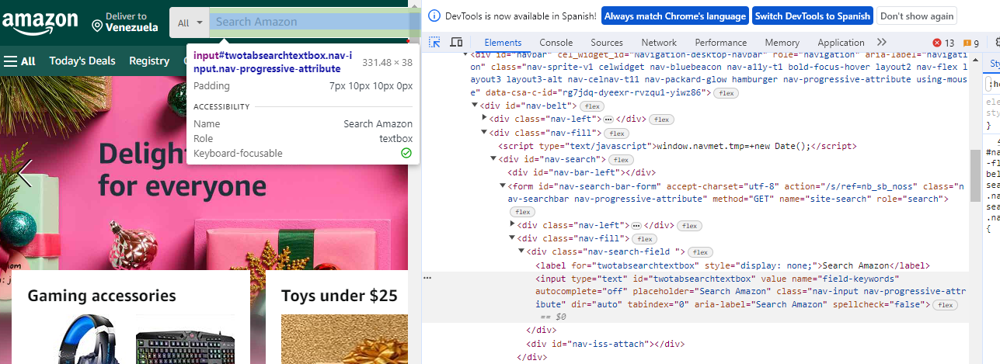
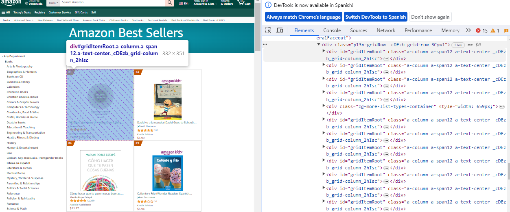

# <div align="center">Web Scraping</div>

### <div align="center">Web Scraping con Python y Selenium en Amazon</div>


:bookmark_tabs: En este repositorio encontrarás un script de Python para realizar web scraping con la librería Selenium.


:yellow_circle: El web scraping consiste en la extracción automatizada de datos de cualquier página web, en este caso he decidido ejecutarlo en la página de Amazon por motivos de practicidad, los datos extraídos fueron de la lista de los 30 libros en español más vendidos y de allí se obtuvo;  ID, autores, títulos y comentarios. 

### <div align="center">Código</div>

La librería Selenium permite emular la interacción del usuario con los navegadores y automatizarlo. 

La primera parte del código ingresa a la página de Amazon y busca específicamente los bestseller en español. 

- Importa el módulo WebDriver que proporciona todas las implementaciones para el navegador. 
- Importa la clase By la cual es necesaria para ubicar los elementos de la página
  
```
from selenium import webdriver
from selenium.webdriver.common.by import By
import time
```

Para localizar los elementos siempre se ingresa el método ``` find_element() ```, este permite localizar por ID, nombres, link, selectores, entre otros. En este primer paso se localiza el ID del buscador y se envía la palabra "book" para buscar el producto. 

Los elementos a colocar en el método find_element() se buscan en el código HTML que proporciona cada página;





```
driver = webdriver.Chrome()
driver.get("https://www.amazon.com/es")


time.sleep(5)

try:
    
    buscar_amazon = driver.find_element(By.ID, "twotabsearchtextbox")
    buscar_amazon.click()
    buscar_amazon.send_keys("book")
    buscar_amazon.submit()
    
except:
    pass

```

Luego, con otros localizadores, como find_element(By.PARTIAL_LINK_TEXT) se puede buscar "Libros en Español" y "los más vendidos".

```    
    buscar_libros = driver.find_element(By.PARTIAL_LINK_TEXT, "Libros en Español")
    buscar_libros.click()

```


En la segunda parte de código se itera por cada uno de los elementos con el fin de obtener los Id, luego se realiza otra iteración para abrir página por página los libros y obtener el nombre de los libros, los autores y los comentarios principalmente. 

En el código HTML se observa que el ID para todos los elementos es "gridItemRoot". 



Se copia el XPath para asignarlo al localizador y se limita a los primeros 30 elementos.

```
elementos = driver.find_elements(By.XPATH, '//div[@id="gridItemRoot"]')[:30]

```

Se realizan las iteraciones, y por último se crea un Dataframe con las listas.

##### Referencias
- https://www.selenium.dev/documentation/webdriver/getting_started/first_script/
- https://aprendepython.es/pypi/scraping/selenium/


